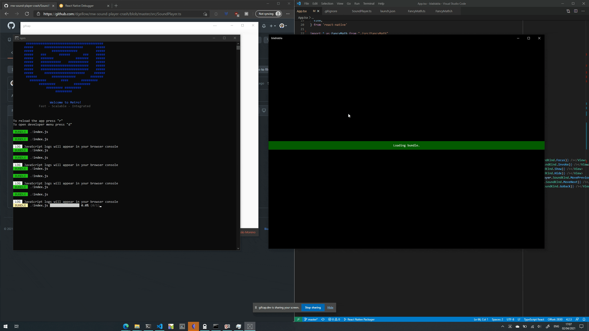

# Sample project crashing React Native Windows

Bug report: https://github.com/microsoft/react-native-windows/issues/7517

## Fix

Check https://github.com/dgellow/rnw-crash-sample-1/pull/1 for the fix!

## Steps to reproduce

1. `git clone https://github.com/dgellow/rnw-crash-sample-1.git`
2. `cd rnw-crash-sample-1`
3. `yarn install`
4. `yarn windows`
5. after the application started, click on a "play sound" button (see gif screencast below)
6. notice how the application crashes without stack trace or error log (it just exits directly)

